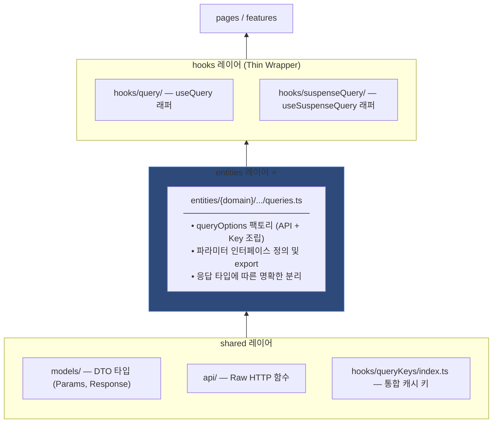

# Custom Query Hook 작성 컨벤션

> 서버 상태 데이터를 가져오는 커스텀 훅을 만들 때 따르는 레이어드 아키텍처 패턴입니다.
> FSD-lite 원칙에 기반하여, **의존성 방향은 항상 아래에서 위로(shared → entities → hooks → pages)** 흐릅니다.

---

## 1. 아키텍처 다이어그램



---

## 2. 레이어별 상세 규칙

### 2-1. Query Key Import 규칙 (Shared)
**파일 경로:** `hooks/queryKeys/index.ts`

모든 Query Key는 개별 파일이 아닌 **통합 `index.ts`를 통해 import** 합니다. 이는 프로젝트 전체에서 키 관리의 일관성을 유지하기 위함입니다.

```typescript
// ❌ BAD
import reviewKeys from '@/hooks/queryKeys/reviewKeys';

// ✅ GOOD
import { reviewKeys } from '@/hooks/queryKeys';
```

---

### 2-2. Entity 레이어: 분리 전략 (핵심 ⭐️)

응답 데이터의 구조(Response Type)에 따라 **Options 함수를 합칠지, 나눌지** 결정합니다.

#### 패턴 A: 별도 Options 함수 (V1, V2 처럼 응답이 다른 경우)
V1과 V2는 대부분 응답 필드나 구조가 다릅니다. 이 경우 무리하게 공통 함수를 만들기보다, **각각의 전용 Options 함수**를 만드는 것이 타입 안정성과 가독성 면에서 가장 좋습니다.

```typescript
// entities/display/review/queries.ts

// V1 전용 Options
export const productReviewListOptions = <T = GetProductReviewListResponse>(
    params: UseProductReviewListParams<T>
) => queryOptions({
    queryKey: reviewKeys.list(params.productNo, params.searchParams),
    queryFn: () => review.getProductReviewList(params.productNo, params.searchParams),
    ...params.options
});

// V2 전용 Options (응답 타입이 다르므로 별도 정의)
export const productReviewListV2Options = <T = GetProductReviewListV2Response>(
    params: UseProductReviewListV2Params<T>
) => queryOptions({
    queryKey: reviewKeys.listV2(params.productNo, params.searchParams),
    queryFn: () => review.getProductReviewListV2(params.productNo, params.searchParams),
    ...params.options
});
```

#### 패턴 B: 내부 팩토리 함수 (응답 타입이 동일한 경우)
`banner` 처럼 `id`로 조회하든 `code`로 조회하든 **응답 데이터 구조가 동일**하다면, 내부 `createQueryFn`을 통해 로직만 분리합니다.

```typescript
// entities/banner/queries.ts

// 응답 타입이 GetBannersResponse로 동일하므로 내부에서 분기 가능
const createQueryFn = (type: 'code' | 'id', banners: string[]) => {
    return async () => {
        const { data } = type === 'code' 
            ? await banner.getBanners(banners) 
            : await banner.getBannersByIds(banners);
        return data;
    };
};
```

> [!CAUTION]
> **중요 제약사항**: `createQueryFn` 패턴은 모든 분기 케이스의 **응답 타입이 완전히 일치**할 때만 사용합니다. 응답 타입이 다르면 패턴 A(함수 분리)를 선택하세요.

---

## 3. 네이밍 및 경로 규칙 요약

| 항목 | 규칙 | 예시 |
|------|------|------|
| **API 함수** | `get/post/put/delete` +PascalCase +버전(필요시) | `getProductReviewListV2` |
| **Query Key Import** | 반드시 `@/hooks/queryKeys` 로부터 Destructuring | `import { reviewKeys } from '@/hooks/queryKeys'` |
| **Entity 함수** | 응답 타입이 다르면 각각 정의 | `xxxOptions`, `xxxV2Options` |
| **Entity 인터페이스** | `Use{HookName}Params<T>` | `UseProductReviewListV2Params<T>` |

---

## 4. 체크리스트 (새 훅 추가 시)

```
[ ] queryKeys를 개별 파일이 아닌 '@/hooks/queryKeys'에서 import 했는가?
[ ] V1, V2와 같이 응답 타입이 다른 경우 각각 별도의 Options 함수를 작성했는가?
[ ] Entity의 인터페이스와 Options 함수가 모두 export 되어 있는가?
[ ] 훅 레이어(Hooks)는 로직이 없는 Thin Wrapper 형태인가?
```
