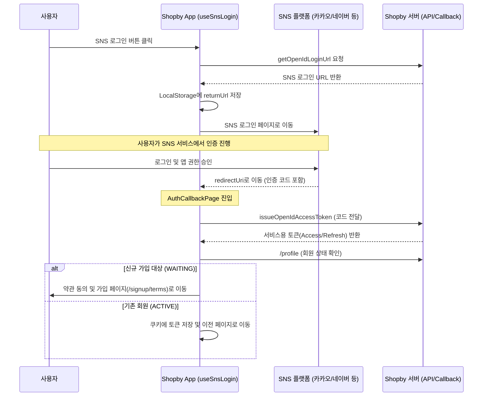

# SNS 로그인 프로세스 다이어그램

```mermaid
sequenceDiagram
    participant User as 사용자
    participant App as Shopby App (useSnsLogin)
    participant SNS as SNS 플랫폼 (카카오/네이버 등)
    participant Server as Shopby 서버 (API/Callback)

    User->>App: SNS 로그인 버튼 클릭
    App->>Server: getOpenIdLoginUrl 요청
    Server-->>App: SNS 로그인 URL 반환
    App->>App: LocalStorage에 returnUrl 저장
    App->>SNS: SNS 로그인 페이지로 이동

    Note over User,SNS: 사용자가 SNS 서비스에서 인증 진행

    User->>SNS: 로그인 및 앱 권한 승인
    SNS-->>App: redirectUri로 이동 (인증 코드 포함)

    Note over App: AuthCallbackPage 진입
    App->>Server: issueOpenIdAccessToken (코드 전달)
    Server-->>App: 서비스용 토큰(Access/Refresh) 반환
    App->>Server: /profile (회원 상태 확인)

    alt 신규 가입 대상 (WAITING)
        App->>User: 약관 동의 및 가입 페이지(/signup/terms)로 이동
    else 기존 회원 (ACTIVE)
        App->>App: 쿠키에 토큰 저장 및 이전 페이지로 이동
    end
```
